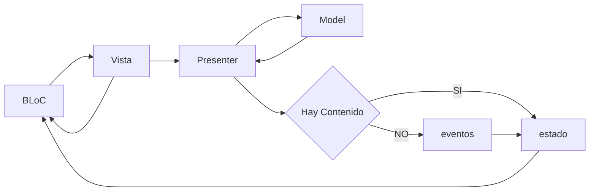

# Prueba Técnica INLAZE

Este proyecto está desarrollador en Flutter con el lenguaje de programación Dart y patrón MVP.

## Requisitos

- Instalar y configurar Flutter en el computador. [Link Flutter](https://flutter.dev/docs/get-started/install)
- Instalar y configurar Android Studio. [Link Android Studio](https://developer.android.com/studio)

> Versión Flutter: 3.19.3

## Arquitectura Aplicación BooksIT

Para este desarrollo, la `view` utiliza el `presenter` para consumir la información del servicio, formatear la información de los libros nuevos y las búsquedas y una vez tenerla lista actualizar el `BLoC` y este a su vez utiliza el contenido de la `view` cuando cambia de estado.

## Pruebas y funcionalidad.

Documentación u/o explicación de funcionalidad que tiene la aplicación.

### LoginView

El campo `Email` tiene la acción en el teclado para pasar al siguiente campo de texto y el campo `Contraseña` tiene la acción de cerrar el teclado, en este caso al ingresar a cualquiera de estos dos campos y al dar tap en la pantalla en otro lado elimina el focus del campo y sale de este, se podrá usar cualquier usuario y contraseña para poder iniciar sesión, pero las validaciones de los campos tiene que ser un email válido y una contraseña con mínimo 6 caracteres. Al presionar el botón `Iniciar sesión` va a almacenar el usuario y contraseña en los `SharedPreferences` y se podrán consultar desde la pantalla de HomeView en la campana del AppBar en la parte superior derecha y una vez echo esto redirige a la pantalla HomeView.

### HomeView

En esta pantalla para poder visualizar la información del email y password almacenados en los `SharedPreferences` se deberá tocar la campana de la parte superior derecha.
Para poder buscar un libro en específico habrá un buscador en donde podrá digitar el nombre del libro que se está buscando, en caso de que se inicie a digital en la parde de abajo se encontrará la lista de las búsquedas relacionadas a los libros, al presional el botón buscar del teclado se almacenará en caché el nombre que se buscó el libro, de igual manera al elegir un libro de esta lista también almacenará la búsqueda y lo llevará al detalle del libro seleccionado, una vez retorne a la pantalla principal de la búsqueda se podrá eliminar manualmente el texto que se buscó o se puede dar clic en el ícono `X` del lado derecho y eliminará el texto, al hacer esto se volverá el focus al campo buscar y tendrá la búsqueda anterior almacenada, en caso de que se quiera eliminar habrá un botón `X` para poder eliminar el registro o la búsqueda o en su defecto al hacer varias búsquedas y dando el el botón buscar se alamcenará la búsqueda y una vez tenga máximo 5 registros almacenados eliminará la primera búsqueda o la búsqueda más antigua para poder almacenar la nueva búsqueda.

De igual forma habrá un scroll horizontal con la sección de los nuevos libros, al dar clic en alguno se enviará al detalle del libro seleccionado.

### DetailsBookView

